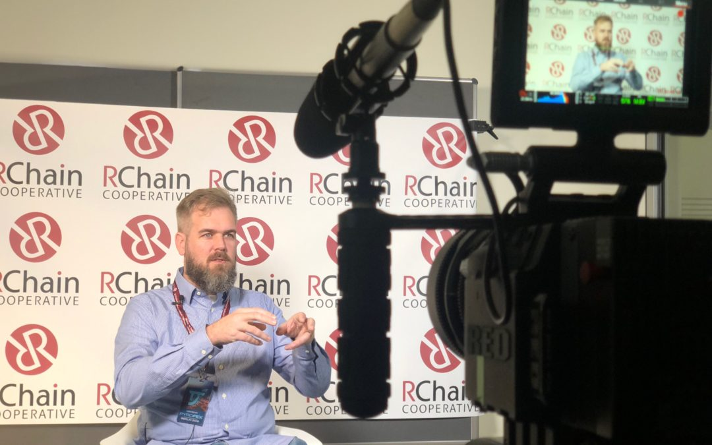

RCON3 INTERVIEW: MIKE STAY

https://www.youtube.com/watch?v=MBdfkOtseB8

MIKE STAY’S BACKGROUND

Mike worked with Google in 2007, creating software security tools for the ad team. In 2009, he met Greg Meredith and became interested in formalizing the steps of computation, trying to characterize it in a way he did in the rosetta stone paper.

Mike and Greg worked on a social network program, which led to an information economy that allows people to filter the information and create more content from it. In 2014, he connected with Nash Foster to create Pyrofex on a distributed computation. About two years later, Mike, Nash, and Greg teamed up to work on the RChain platform.

At RChain, they also work on Rholang, a new language for writing smart contracts that run on the Rholang virtual machine (RhoVM). It is inherently concurrent and better suited to distributed programming than sequential languages based on Turing machines or Church’s lambda.

### WHAT IS A COMM EVENT?

Mike Stay describes a COMM event as a type of transaction. It’s different from what many people may think of as a transaction. Something like the transfer of a token from one account to another would be about 10 COMM events.

A COMM event is a delivery of a message from one process to another process. The idea of having a listener (a smart contract) and a sender, and joining them together is a COMM event. This is the fundamental process that Rholang does, and it’s how RChain measures each interaction on the platform.

Of course, on the RChain platform, you can send transactions, in the sense of sending monetary value from one purse (or wallet) to another.

### UNDERSTANDING TUPLE SPACE AND RHOLANG

A tuple space is a collection of things called names; these names are places where messages can be exchanged. You can send a message on a name and multiple messages to the same name.

The interesting thing about Rholang is that even if there’s no data in the table (tuple space), you can issue a query, and then it will just hang onto the query until data shows up for the contract to process. That’s really what a contract is, a query that says, give me all the data that’s coming in on this name, and then I will handle those messages and produce more messages in turn. But the contract is just sitting there, waiting for data. Whenever new data comes in, it runs and processes it. So you can have multiple contracts listening on a name, multiple data coming in on a name. They compete with one another to get access to these resources to do their processing and send more messages out. So the tuple space is really the fundamental data structure that’s being manipulated by the Rholang language.

### SHARD INTERACTION AND SECURITY

RChain will have a root shard that will allow others to create their own blockchains known as child shards. The child shard can have different policies and a different kind of relationship between the parent and child shards than RChain’s, which is based on a depository and mint relationship between parent and child. The parent shard has a depository that backs everything the child shard’s mint issues.

There’s a security check in place to keep the main network protected and limit the damage from bad actors. The parent shard won’t let the child shard take more out of the depository than it put in. This means that if bad actors mess up the economics of a child shard, it won’t affect the economics of the rest of the network.

You’re always vulnerable when there’s a large enough coalition of validators. In this case, they have the possibility to mint more in the child shard than they have backing the parent shard. The default depository and mint contract keeps them pegged 1 to 1 … If they put a thousand REV in but issued two thousand, only the first thousand of it would be honored, and after that the remaining child REV would be worthless.

To learn more about Pyrofex and the projects that are being developed, visit their site. If you’re interested in watching Mike’s lectures at the RChain developer conference, which cover namespaces and consensus, click here.
